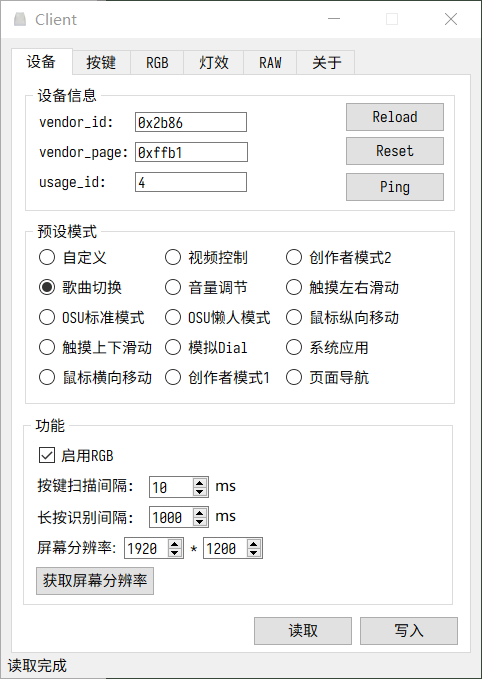

# Keyboard nano client

Keyboard nano 小键盘配置工具（上位机）

## 功能

- [x] 预设键盘模式组

- [x] 自定义按键

  - [x] 标准键盘按键
    - [x] 组合键
    - [x] 多键按下无冲突
    - [ ] 特殊键（Qt无法输入的键位）
    - [ ] Fn 多层
  - [x] 模拟鼠标
    - [ ] 双击功能
  - [x] 多媒体键

  - [x] 模拟Dial
  - [x] 模拟触摸屏（使用屏幕绝对位置）
  - [x] OSU！自动轮盘

- [x] 自定义灯光

  - [x] RGB Color Codes 支持
  - [ ] 渐变灯效
  - [X] 按动灯效

- [x] HID数据通信

- [x] [简单HTTP API](./simple_api.py) 

## 平台

Python 3.8 + Pyside2

## Note

高分屏适配可能存在显示异常的问题，可以通过修改`./Data/config.yaml`中 `AA_EnableHighDpiScaling`的值来开关高分屏适配功能

## 杂项

[pyhidapi](https://github.com/apmorton/pyhidapi)

